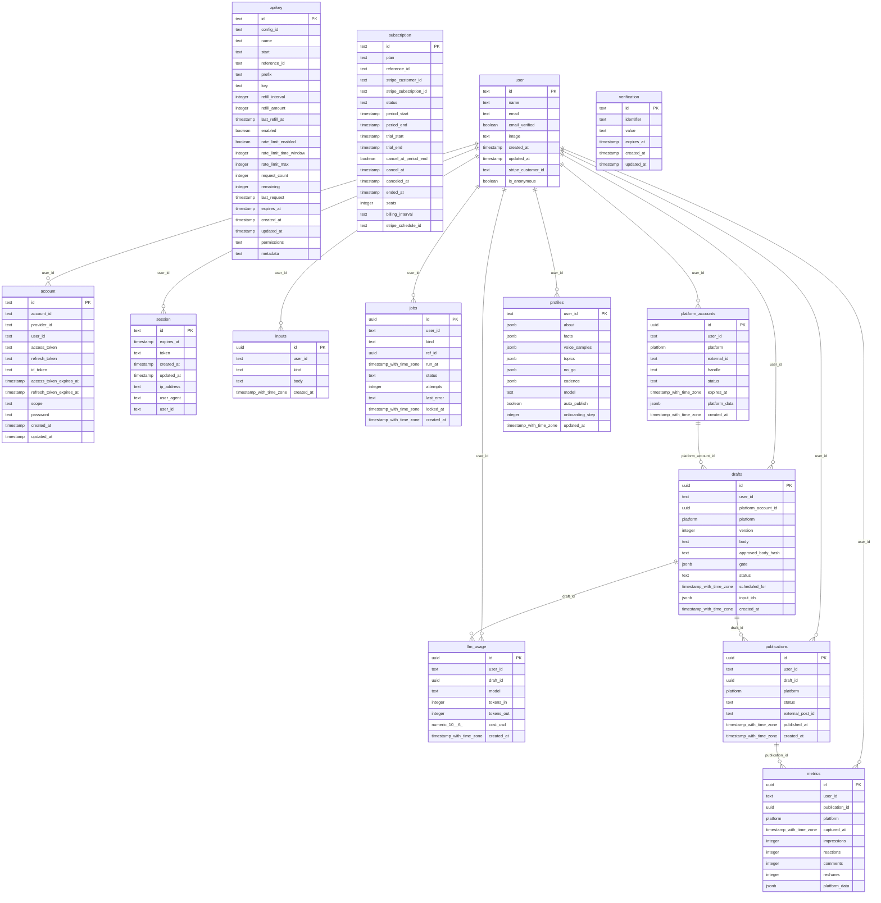

# Cadence architecture

Cadence turns a short weekly check-in into LinkedIn posts in the user's own voice, checks them against the
user's own facts, and publishes the ones they approve through LinkedIn's official API. Multi-user,
subscription-billed, hosted on Railway as two services (`web`, `worker`) plus Postgres.

## Systems, by layer

| Layer | Components | Notes |
|---|---|---|
| Front-end | Next.js 16 App Router. Public: `/`, `/how-it-works`, `/demo`, `/login`, `/terms`, `/privacy`, plus `sitemap.xml`, `robots.txt`, `opengraph-image`, `/llms.txt`, `/llms-full.txt`. Signed in: `/checkout`, `/onboarding` (3-step stepper), `/app` (This week: check-in and draft cards with "Why this draft"), `/app/published`, `/app/settings`. shadcn/ui on Base UI | Server components gate every signed-in page; `src/proxy.ts` is only a fast cookie check. `catalog-view.tsx` renders `src/lib/catalog.ts` |
| Back-end | Postgres. Better Auth tables (`user`, `session`, `account`, `verification`, `subscription`) and app tables (`platform_accounts`, `profiles`, `inputs`, `drafts`, `publications`, `metrics`, `jobs`, `llm_usage`) | Row-level security on every app table; queries run as the unprivileged `cadence_app` role via `asUser()` / `asWorker()` in `src/db/index.ts` |
| Middleware | **Services** (`src/services/`: account, profile, drafts, publications, stats, errors): the one place business rules live; the web app's server actions, the public API and the MCP server are thin clients. **Public API** (`src/api/app.ts`, Hono + `@hono/zod-openapi`, mounted at `/api/v1`; OpenAPI at `/api/v1/openapi.json`, Scalar reference at `/docs/api`; API keys via `@better-auth/api-key`). Better Auth (LinkedIn OIDC + `w_member_social` in one consent, tokens encrypted; `anonymous` plugin in demo mode only). Stripe plugin (checkout with 7-day trial, portal, webhook at `/api/auth/stripe/webhook`). Server actions (`onboarding/actions.ts`, `app/actions.ts`). **Engine** (`src/engine/`: format, gate, facts, suppress, evaluate, schedule; pure). **Writer** (`src/lib/llm.ts`: Claude or demo). **Platform adapter** (`src/platforms/`: LinkedIn Posts API or demo). **Pipelines** (`drafting.ts`, `publishing.ts`, `reminders.ts`). **Job queue** (`jobs.ts`) | Thresholds live only in `src/lib/catalog.ts` |
| Infrastructure | Railway: `web` (`railway/web.json`, runs migrations before deploy) and `worker` (`railway/worker.json`, esbuild bundle `dist/worker.mjs`), Postgres. GitHub Actions: CI (scrub, arch, catalog, typecheck, lint, migrate, unit and DB tests, build, Playwright demo smoke) and release (notes from CHANGELOG, demo MP4 attached) | Secrets only in Railway variables. `pnpm demo` runs everything locally with no keys |

## Features and the tables they own

- **Sign-in and billing**: Better Auth and its Stripe plugin. Owns `user`, `session`, `account`, `verification`, `subscription`.
- **Connection to a platform**: `platform_accounts` (identity, status, expiry). The OAuth token itself stays in `account` (encrypted), one source of truth.
- **Setup (once)**: `profiles`: about, facts, voice samples, topics, no-go list, cadence, model, auto-publish.
- **Weekly check-in**: `inputs`. Saving one enqueues a `draft` job in the same transaction.
- **Drafting**: `drafts` (body, version, `gate` = the "Why this draft" record) and `llm_usage` (every model call, and the $5 monthly cap).
- **Publishing**: `publications` (one per draft, unique; the only publish state machine) and `drafts.approved_body_hash`.
- **Background work**: `jobs` (draft, publish, reminders; `locked_at` lease).
- **Results**: `metrics`, written 24 h and 72 h after each post by the results routine (sample rows in demo mode, flagged in `platform_data`); read by `src/services/stats.ts`.
- **API access**: `apikey` (Better Auth api-key plugin): hashed keys, scopes in `permissions`, per-key rate-limit state.

`apikey.reference_id` references `user.id` (on delete cascade) through a hand-written migration (`drizzle/0005_apikey_user_fk.sql`), because the plugin's generated schema has no foreign key.

**Standalone table:** `subscription` has no foreign key. Its `reference_id` holds the user id, but the Better Auth Stripe plugin also allows organisation references, so it is managed by the plugin rather than constrained here.

## Platforms

Every platform-facing row carries a `platform` enum (`linkedin` today). Shared facts are columns;
platform-only details go in `platform_data`. Adding a platform means a new enum value and a new `PlatformAdapter`.

## Patterns

| Pattern | Where | Use it instead of |
|---|---|---|
| Service layer | `src/services/*`: functions of `(userId, input)` that throw `ServiceError` (mapped to toasts in the app, HTTP statuses in the API) | Rules inside server actions or route handlers |
| Tenant scoping | `asUser(userId, tx => …)`; the worker uses `asWorker` to claim, then `asUser` per job | Hand-written `where user_id =` clauses (RLS enforces it anyway) |
| Server-side gate | `requireUser()` / `requireSubscriber()` in `src/lib/session.ts` | Checks in client components or proxy |
| Validated mutation | Server action + zod, returning `{ ok } \| { ok: false, error }` | Route handlers for form posts |
| One catalog | `src/lib/catalog.ts` holds every threshold and the lists of settings and routines. The engine, pages, llms.txt and README all read it | Numbers repeated in copy or code |
| Real or demo behind one interface | `Writer` (`llm.ts`), `PlatformAdapter` (`platforms/`), email (`email.ts`), chosen by `isDemo()` in `mode.ts`. Demo mode is refused unless localhost or CI | `if (demo)` branches inside pipelines |
| Background job | `enqueue(tx, …)` inside the caller's transaction; `claim()` with `SKIP LOCKED`; `finish()` retries up to 3 times, publish once | Timers, or work inside a request |
| Exactly-once side effect | Write the intent row (`publications.status='publishing'`, unique) and commit, call outside any transaction, then record the result. Lost ones go to `needs_review` | Retrying a call that may have succeeded |

**Why the API needed no new business logic:** every endpoint calls a service function the web app already uses; the only new pieces are transport (Hono), auth (API keys) and documentation (OpenAPI), each an existing library.

**Why no new components were needed for steps 4–5:** drafting, publishing and reminders are all "background job"s. Each outside service reuses "real or demo behind one interface". The draft explanation reuses `drafts.gate` rather than a new table, and reminders reuse `jobs` as their log.

## ERD

<!-- ERD:BEGIN (generated by scripts/erd.mjs) -->

<!-- ERD:END -->
