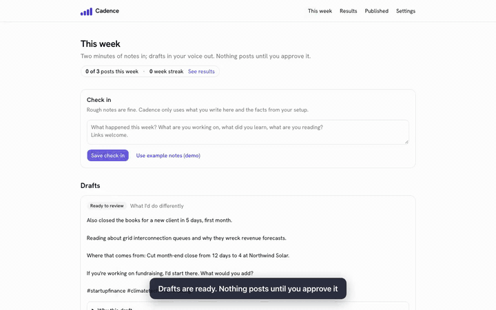

<div align="center">


# Cadence

**LinkedIn posts in your own voice, from two minutes a week.**

Cadence turns a short weekly check-in into LinkedIn posts that sound like you, checks every draft against facts *you* supplied, and publishes the ones you approve through LinkedIn's official API.

[](https://github.com/MAKaminski/cadence/actions/workflows/ci.yml)
[](https://github.com/MAKaminski/cadence/releases)
[](LICENSE)
[](https://nextjs.org)
[](https://www.anthropic.com/claude)

[**Watch the 90-second demo**](https://github.com/MAKaminski/cadence/releases/latest/download/cadence-demo.mp4) · [Demo guide](docs/DEMO.md) · [How it works](#what-cadence-does) · [Run it locally](#run-it-in-two-minutes-no-keys) · [MCP](docs/MCP.md) · [API](docs/API.md) · [Architecture](ARCHITECTURE.md) · [Request a feature](https://github.com/MAKaminski/cadence/discussions/categories/ideas)

<a href="docs/DEMO.md"></a>

</div>

---

## Why Cadence

Most people who *should* post on LinkedIn don't: blank page, no time, and AI tools that sound like AI and make things up. Cadence is built around three rules:

1. **Your voice.** It learns from three of your own posts, not a template.
2. **Your facts only.** Every number, employer and credential in a draft must come from your facts list or that week's notes. Anything else is *held for you* with the exact claim named.
3. **Your approval.** Nothing posts until you approve it. Automatic posting exists, but it unlocks only after 5 clean approvals, and held drafts always wait for you.

It posts through LinkedIn's **official API** (`w_member_social`). No password sharing, browser extensions or scraping.

## What Cadence does

Every setting, weekly action and automatic routine, generated from [`src/lib/catalog.ts`](src/lib/catalog.ts), the same file the app's checks read their thresholds from, so this table can't drift from the behaviour.

<!-- CATALOG:BEGIN (generated by scripts/catalog.ts from src/lib/catalog.ts) -->
**12** settings you choose once · **5** things you do each week · **13** routines that run for you

### Set once (12)

| # | Setting | What it's for |
|---|---|---|
| 1 | **What you do** | Your role, in a line. Every draft is written as you. |
| 2 | **Who you want to reach** | The audience drafts are aimed at. |
| 3 | **What posting should do for you** | Your goal steers the angle of each post. |
| 4 | **Facts list** | The only numbers, employers, results and credentials Cadence may state. Anything else is held. |
| 5 | **Three of your posts** | Teach your voice: sentence length, tone, what you never say. |
| 6 | **Topics** | What you want to be known for. Drafts stay inside these. |
| 7 | **Never write about** | Names, subjects or employers that must not appear. A match holds the draft. |
| 8 | **Posts per week** | 1 to 5 in setup; up to 21 on Plan, across three daily slots. |
| 9 | **Posting days** | Which weekdays posts go out. |
| 10 | **Time of day** | In your own time zone. On Plan, each slot has its own time; drag it on the day view to move it. |
| 11 | **Writing model** | Claude Sonnet 5 (default) or Claude Opus 5. |
| 12 | **Automatic posting** | Off by default. Unlocks after 5 clean approvals; any held check still waits for you. |

### Every week, about two minutes (5)

| # | Setting | What it's for |
|---|---|---|
| 1 | **Check in** | Two minutes of rough notes: what you worked on, learned, shipped or noticed. |
| 2 | **Approve** | Locks the exact text and schedules it into your next slot. |
| 3 | **Edit** | Change anything. An edited draft needs approving again, and it is re-checked. |
| 4 | **Skip** | Drop a draft. Nothing is posted. |
| 5 | **Post now** | Send an approved post straight away instead of waiting for its slot. |

### Runs for you (13)

| # | Routine | When | What it does |
|---|---|---|---|
| 1 | **Drafting** | Right after each check-in | Writes 2 variants in your voice from your notes, facts and topics, and keeps the one that passes the most checks. |
| 2 | **LinkedIn formatting** | Every draft | Strips markdown LinkedIn doesn't render, caps hashtags at 3, tidies line breaks and escapes characters LinkedIn treats as markup. |
| 3 | **Quality check** | Every draft | Hook under 140 characters, under 1300 characters overall, no stock phrases. A miss means one rewrite. |
| 4 | **Fact check** | Every draft | Every number, company and credential must come from your facts list or this week's notes. Otherwise the draft is held for you. |
| 5 | **Repeat and no-go check** | Every draft | Holds a draft that mentions a never-write-about item or is 60%+ similar to one of your last 20 posts. |
| 6 | **Monthly cost cap** | Before every model call | Stops drafting at $5 of model use in a month and tells you, instead of charging more. |
| 7 | **Scheduling** | On approval | Puts the post into your next free posting slot, in your time zone. |
| 8 | **Planning** | When you change a number on Plan | One more post or comment goes where it does the least harm (the widest gap, never on the hour); one fewer comes out of the most crowded spot. Nothing is planned between 22:00 and 06:00. |
| 9 | **Pause** | While posting is paused on Plan | Approved posts keep their place and wait; nothing is published until you resume. |
| 10 | **Publishing** | At the scheduled time | Posts the exact approved text through LinkedIn's official API, once. A post that might have gone out is marked for review, never retried. |
| 11 | **Results check** | 24 and 72 hours after each post | Records impressions, reactions, comments and reshares for the Results charts. Starts once LinkedIn approves analytics access; until then the charts say so. |
| 12 | **Check-in reminder** | The day before your first posting day | An email if you haven't checked in that week. |
| 13 | **Connection reminder** | 7 days and 1 day before LinkedIn access expires | LinkedIn access lasts about 60 days. Signing in again renews it. |

### How a draft gets adjusted

| Outcome | When |
|---|---|
| **Fixed automatically** | Markdown removed (LinkedIn shows it as raw symbols); Hashtags cut to 3; Line breaks normalised; Characters LinkedIn treats as markup escaped |
| **Rewritten once** | First line over 140 characters; A stock phrase from the banned list; Longer than 1300 characters |
| **Held for you, never auto-posted** | A number, company or credential not in your facts or notes; A never-write-about match; 60%+ similar to a recent post; Still failing after the rewrite |

**Coming:** Learning from results: Once LinkedIn approves analytics access: which hooks, topics and times work for you, fed back into drafting.
<!-- CATALOG:END -->

Every draft shows its own **"Why this draft"** panel with the angle chosen, each check's result, what was changed, which model wrote it and what it cost.

## Use cases

| You are… | You check in with… | Cadence gives you… |
|---|---|---|
| A founder | What shipped, what a customer said, what you learned | Build-in-public posts that only cite your real numbers |
| A consultant or fractional exec | A client question you answered this week | Expertise posts that win the next client, without naming the current one (never-write-about list) |
| Job seeking | Projects, results, what you're reading | A steady, credible presence recruiters see, on your schedule |
| An engineer or researcher | A problem you solved | Plain-language posts about technical work, facts checked |

## Run it in two minutes, no keys

Demo mode replaces LinkedIn, Stripe and Claude with local stand-ins, so you can click through the whole product: sign-up, trial, setup, check-in, drafts, approval and publishing.

```bash
git clone https://github.com/MAKaminski/cadence && cd cadence
docker run -d --name cadence-pg -e POSTGRES_PASSWORD=dev -e POSTGRES_DB=cadence -p 55432:5432 postgres:17
pnpm install
pnpm demo            # open http://localhost:3000 and choose "Continue as demo user"
```

Demo mode only switches on for `localhost` or CI, never on a public server ([`src/lib/mode.ts`](src/lib/mode.ts)).

## Use it from Claude, Codex, Cursor or VS Code

Cadence is a remote **MCP server** (`/api/mcp`, OAuth 2.1). Connect it once, then say *"let's do my Cadence check-in"*: your assistant interviews you, saves the notes, walks through each draft and why it reads that way, and shows your results.

```bash
claude mcp add --transport http cadence https://YOUR-CADENCE-HOST/api/mcp   # Claude Code
```

Claude web and desktop: Settings → Connectors → Add custom connector. Cursor and VS Code have one-click buttons on `/integrations`. You choose on the consent screen whether the assistant may approve drafts; it can never post immediately, and **Disconnect** in Settings takes effect at once. Details: [docs/MCP.md](docs/MCP.md).

## iPhone app

A native SwiftUI companion (iOS 26+) in [`ios/`](ios): voice or text check-ins (transcribed on the phone), drafts with the full "why", two-tap approve/edit/skip, Results in Swift Charts, a home-screen widget, and push when drafts are ready. Its Swift client is generated from the same OpenAPI spec as the CLI. Build it with `pnpm ios:gen && pnpm ios:build` against `pnpm demo`. See [docs/ios.md](docs/ios.md).

## API and CLI

Everything in the app is also available through a documented REST API (**OpenAPI 3.1**, generated from the code with `@hono/zod-openapi`; interactive reference at `/docs/api` on any Cadence server) and a CLI:

```bash
npm install -g cadence-posts && cadence login --host https://YOUR-CADENCE-HOST
cat notes.md | cadence checkin     # drafting starts
cadence drafts && cadence why <id> # every check, what changed, the cost
cadence approve <id>               # shows the exact text and asks first
```

- **Scopes:** `read`, `write` and a separate `approve` scope that only you can grant. There is no "publish now" endpoint; approved posts go out on your schedule.
- **Limits:** 60 requests per minute per key (`RateLimit-*` headers, `429` with `Retry-After`) and 20 check-ins a day.
- **Errors:** RFC 9457 problem+json.

Full reference: [docs/API.md](docs/API.md) · [OpenAPI spec](docs/openapi.json) · [CLI](cli/README.md)

## Pricing

**$20/month after a 7-day free trial** (card first, cancel anytime) on the hosted version. Self-hosting is free under the MIT licence; you bring your own LinkedIn app, Stripe account and Anthropic key.

Unit economics at $20/user/month, from the [plan](ARCHITECTURE.md). Actual costs are metered per user in `llm_usage`:

| Per user / month | Claude Sonnet 5 (default) | Claude Opus 5 |
|---|---|---|
| Revenue | $20.00 | $20.00 |
| Stripe fees | −$0.88 | −$0.88 |
| Model use, about 13 posts | −$1.15 | −$2.90 |
| Hosting and email | −$0.20 | −$0.20 |
| **Contribution** | **$17.77 (88.9%)** | **$16.02 (80.1%)** |

Model use is capped at $5 per user per month, so the worst case is $13.92 (69.6%).

## Stack

| Layer | What |
|---|---|
| Front-end | Next.js 16 (App Router), Tailwind v4, shadcn/ui on Base UI |
| Back-end | Postgres with row-level security on every tenant table, Drizzle ORM and migrations |
| Middleware | Better Auth (LinkedIn OIDC, encrypted tokens) with its Stripe plugin (trial, portal, webhooks). Claude via `@anthropic-ai/sdk` (structured output, prompt caching). A Postgres job queue (`FOR UPDATE SKIP LOCKED`) |
| Infrastructure | Docker Compose on one Oracle Cloud Always Free VM: `web`, `worker`, Postgres 17, Caddy for HTTPS, nightly backups (`deploy/`). GitHub Actions CI with a Playwright smoke test of the demo |

See [ARCHITECTURE.md](ARCHITECTURE.md) for the generated ERD, which tables each feature owns, and the patterns every feature reuses.

## Self-hosting

1. Create a LinkedIn app at <https://www.linkedin.com/developers/apps>. Add the products **Sign In with LinkedIn using OpenID Connect** and **Share on LinkedIn**, and the redirect URL `https://YOUR_DOMAIN/api/auth/callback/linkedin` (the same domain as `BETTER_AUTH_URL`). Put its Client ID and secret in `deploy/.env`: `deploy/deploy.sh` checks them with `deploy/check-env.sh` and refuses an empty or placeholder ID.
2. Create a Stripe product with a monthly price, plus a webhook to `https://YOUR_DOMAIN/api/auth/stripe/webhook`.
3. On any Linux server with Docker (Cadence runs on an Oracle Cloud Always Free ARM VM): `deploy/setup-vm.sh` installs Docker, opens ports 80 and 443 and clones the repo. Point your domain's DNS at the server.
4. Copy `deploy/env.example` to `deploy/.env` (mode 600) and fill it in; never commit it. Treat `BETTER_AUTH_SECRET` as permanent: it encrypts stored LinkedIn tokens and the OAuth signing keys, so rotating it means everyone reconnects (and you must clear the `jwks` table).
5. `docker compose -f deploy/compose.yml --env-file deploy/.env up -d --build` runs migrations, then the web app, worker, Caddy (automatic HTTPS) and a nightly database backup. Later deploys: `CADENCE_HOST=opc@IP deploy/deploy.sh`.

## Development

```bash
pnpm dev                 # web app (needs the live variables, or use `pnpm demo`)
pnpm worker              # the job worker
pnpm test                # unit tests; database tests need TEST_DATABASE_URL
pnpm test:e2e            # Playwright smoke test against a running `pnpm demo`
pnpm openapi             # regenerate docs/openapi.json (CI checks it's current)
pnpm --filter cadence-posts build   # build the CLI
pnpm demo:record         # re-record the demo video from the running app
pnpm arch && pnpm catalog   # regenerate ARCHITECTURE.md's ERD and this README's catalog block
```

`pnpm scrub` checks nothing personal or secret is in the tree before you push.

## Roadmap

- [x] Sign in with email or LinkedIn, Stripe trial and subscription, guided setup
- [x] Weekly check-in → drafts in your voice, with fact, quality, repeat and never-write-about checks
- [x] Approve, edit, skip, post now; scheduling in your time zone; publishing exactly once
- [x] Reminders, monthly cost cap, demo mode, demo video
- [x] Results charts: outreach against your target, impact per post, what works (v0.3)
- [x] Public API with OpenAPI reference, API keys with scopes and rate limits, CLI (v0.4)
- [x] MCP server for Claude, Codex, Cursor and VS Code with OAuth and one-click installs (v0.5)
- [ ] Claude directory listing (submission pack ready in [docs/claude-directory.md](docs/claude-directory.md); needs the public deploy)
- [x] Server support for iOS: OAuth for the API, push, account deletion, App Review access (v0.6)
- [ ] iOS companion app on the App Store (built and running on the simulator; TestFlight next)
- [ ] Post analytics from LinkedIn, and learning from results (waiting on LinkedIn's approval)
- [ ] Images and documents in posts
- [ ] More platforms. The data model already tags every row with its platform, so [tell us which](https://github.com/MAKaminski/cadence/discussions/categories/ideas)

## FAQ

<details><summary><b>Does Cadence log in to my LinkedIn account?</b></summary>
No. It uses LinkedIn's official sign-in and the official Posts API with the "share on LinkedIn" permission. It never sees your password and never automates your browser.
</details>
<details><summary><b>Can it comment, send invites or DMs?</b></summary>
No. LinkedIn's API doesn't permit that for member apps, and Cadence only does what the official API allows.
</details>
<details><summary><b>Which AI writes the drafts?</b></summary>
Anthropic's Claude: Claude Sonnet 5 by default, Claude Opus 5 optional per user.
</details>
<details><summary><b>What stops it from making things up?</b></summary>
A deterministic fact check (<code>src/engine/facts.ts</code>): any number, organisation or credential not in your facts or notes holds the draft for you.
</details>
<details><summary><b>Can a post go out twice?</b></summary>
No. A publication row is written before the API call, under a unique key per draft. If the worker dies mid-publish, the post is marked for review and never retried. <code>tests/pipeline.test.ts</code> kills the process mid-publish to prove it.
</details>

## Contributing

Issues, ideas and pull requests are welcome. See [CONTRIBUTING.md](CONTRIBUTING.md). Security reports go to [SECURITY.md](SECURITY.md), not public issues.

## License

[MIT](LICENSE). Cadence is not affiliated with LinkedIn or Anthropic.
